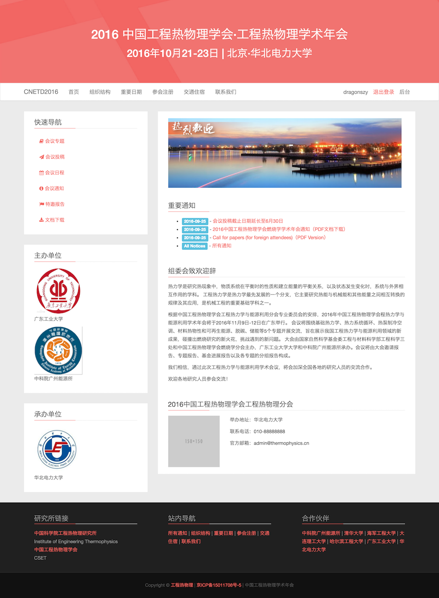
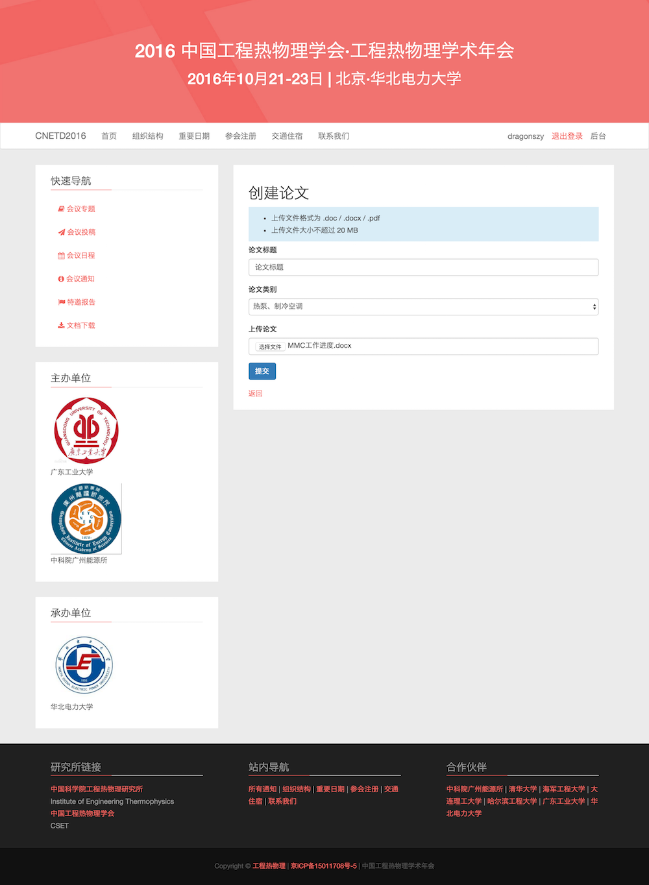
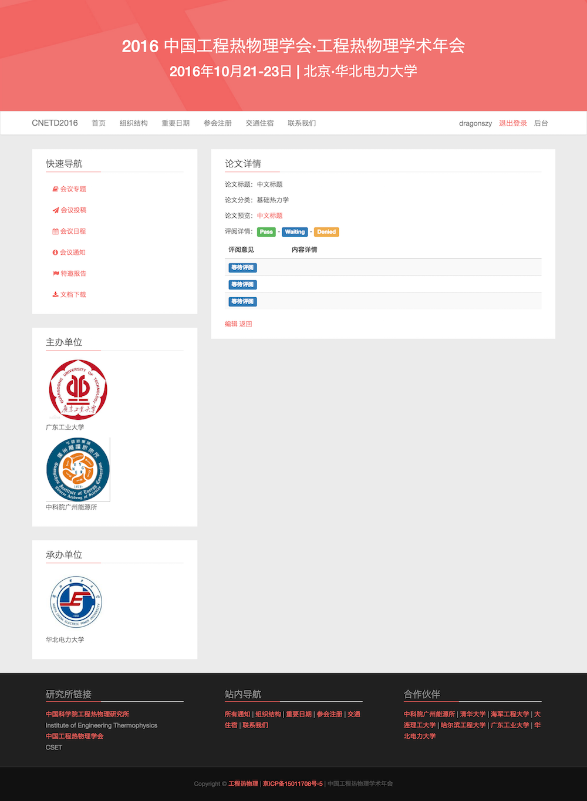
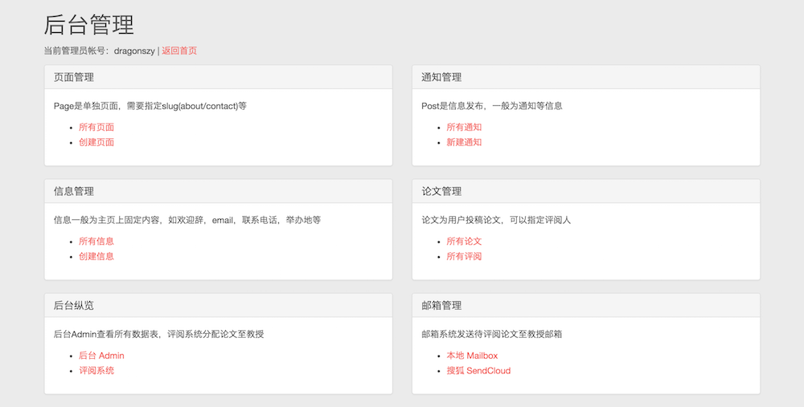
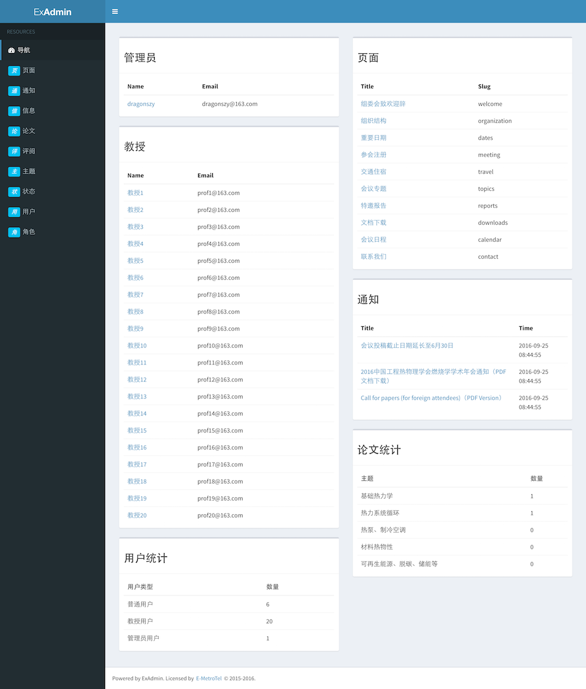
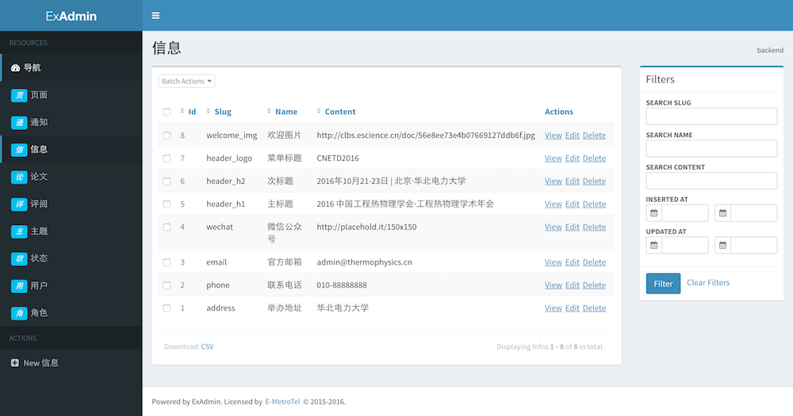
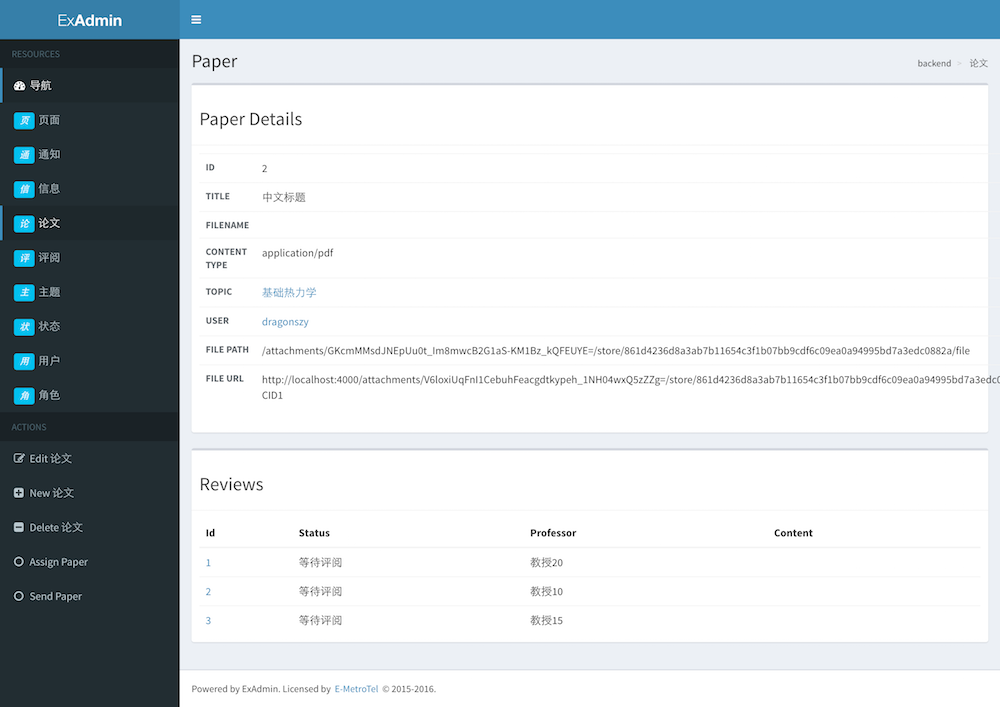

# Confer

Academic Conference Management System

  * User
  * Create and migrate your database with `mix ecto.create && mix ecto.migrate`
  * Install Node.js dependencies with `npm install`
  * Start Phoenix endpoint with `mix phoenix.server`

## Learn more

  * Official website: http://www.phoenixframework.org/
  * Guides: http://phoenixframework.org/docs/overview
  * Docs: https://hexdocs.pm/phoenix
  * Mailing list: http://groups.google.com/group/phoenix-talk
  * Source: https://github.com/phoenixframework/phoenix

## TODO
  * 权限系统 role check --- 完成
  * 邮件系统 swoosh smtp --- 使用网易免费企业邮箱
  * 文件上传 exfile --- 自定义文件名，需要exfile_imagemagick和系统安装imagemagick
  * https
  * 部署 --- ./start_server.sh ./stop_server.sh ./backup_db.sh
  * 安装 elixir 环境，erlang编译环境，phoenix环境，imagemagick，有了exfile的imagemagick才能重命名扩展名

## Show

